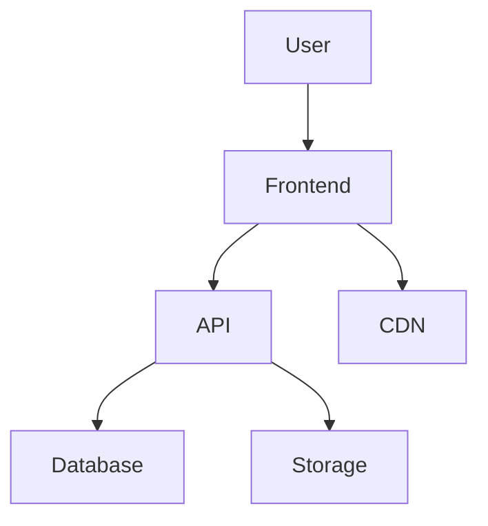
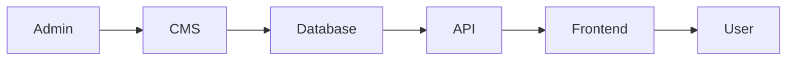
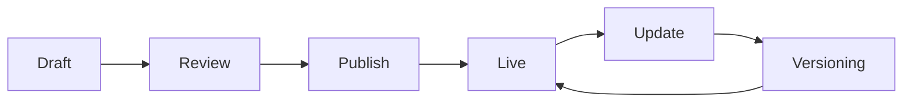

# PORTFOLIO PLATFORM

## Requirements & System Architecture Document

**Project Name:** Penjy Portfolio Platform
**Version:** 1.0
**Author:** Narmaye Patrick (Penjy)

---

# 1. 🎯 EXECUTIVE SUMMARY

The Penjy Portfolio Platform is a **dynamic, modular digital experience** designed to present multiple professional identities (Developer, Designer, Artist, Strategist) through an adaptive interface.

Unlike traditional portfolios, this system:

* Dynamically adjusts content based on user interest
* Integrates structured project storytelling
* Supports continuous updates through an administrative control panel

The platform is built as a **scalable product**, not a static website.

---

# 2. 🧭 OBJECTIVES

### Primary Goals

* Showcase multidisciplinary skills in a structured way
* Provide an immersive and interactive user experience
* Enable easy content updates without code changes
* Support long-term scalability and extensibility

### Secondary Goals

* Optimize for performance and SEO
* Enable analytics-driven improvements
* Maintain a strong personal brand identity

---

# 3. 👥 USER ROLES

## 3.1 End Users (Visitors)

* Navigate portfolio content
* Filter content based on interests
* View projects, case studies, and creative works
* Contact or initiate collaboration

## 3.2 Administrator (Owner)

* Manage all content
* Configure experience behavior
* Monitor analytics
* Maintain system integrity

---

# 4. 🧩 FUNCTIONAL REQUIREMENTS — PORTFOLIO (CORE SYSTEM)

## 4.1 Dynamic Experience System

The platform must support:

* Skill-based navigation (Developer, Designer, Artist, Hybrid)
* Dynamic filtering of content
* Context-aware UI rendering

---

## 4.2 Core Modules

### 4.2.1 Projects Module

* Create, edit, delete projects
* Project attributes:

  * Title
  * Description
  * Category (Dev, Design, Art, etc.)
  * Tech stack
  * Media assets
  * Tags (skills)
  * Status (Draft / Published / Archived)

---

### 4.2.2 Case Studies Module

* Structured storytelling:

  * Problem
  * Approach
  * Process
  * Outcome
* Rich content support (text, images, videos)

---

### 4.2.3 Creative Showcase

* Illustration gallery
* Pixel art / game assets
* Branding work
* Media preview support

---

### 4.2.4 Skill Mapping System

* Define skills
* Link skills to:

  * Projects
  * Case studies
  * Categories
* Enable filtering and personalization

---

### 4.2.5 Contact Module

* Contact form
* Message categorization
* Optional integrations (email services)

---

### 4.2.6 Experience Layer (UI/UX)

* Animated transitions
* Scroll-based interactions
* Parallax effects
* Optional 3D elements

---

# 5. 🏗️ SYSTEM ARCHITECTURE

## 5.1 High-Level Architecture

---

## 5.2 Frontend Architecture

* Framework: **Next.js**
* Styling: **Tailwind CSS**
* Responsibilities:

  * UI rendering
  * Client-side interactions
  * Animation handling
  * Routing and SEO optimization

---

## 5.3 Backend Architecture

### Option A (Recommended - MVP)

* Firebase

  * Firestore (database)
  * Firebase Storage (media)
  * Firebase Auth (admin access)

### Option B (Scalable)

* Node.js / NestJS API
* PostgreSQL database
* Cloud storage (e.g., S3)

---

## 5.4 Data Flow

---

# 6. 🗄️ DATA STRUCTURE (HIGH-LEVEL)

## Collections / Tables

* `users`
* `projects`
* `case_studies`
* `skills`
* `media`
* `categories`
* `messages`
* `settings`

---

# 7. ⚙️ ADMIN PANEL (CONTROL SYSTEM)

## 7.1 Purpose

The Admin Panel is designed to:

* Manage all portfolio content
* Control user experience behavior
* Enable real-time updates

---

## 7.2 Admin Modules

### 7.2.1 Content Management

* Projects CRUD
* Case studies CRUD
* Skills management
* Categories management

---

### 7.2.2 Media Management

* Upload images/videos
* Optimize assets
* Tag and organize media

---

### 7.2.3 Skill Mapping Manager

* Link skills to projects and content
* Define relationships between entities

---

### 7.2.4 Experience Configuration

* Enable/disable sections
* Set featured projects
* Control homepage layout
* Adjust animation intensity

---

### 7.2.5 Analytics Dashboard

* Visitor metrics
* Most viewed content
* Engagement tracking

---

### 7.2.6 User Management

* Admin authentication
* Role-based access (optional future feature)

---

## 7.3 Admin Workflow

---

## 7.4 Key Admin Requirements

* Real-time updates
* Draft and publish system
* Version tracking (basic)
* SEO metadata management
* Secure authentication

---

# 8. 🔐 NON-FUNCTIONAL REQUIREMENTS

## Performance

* Fast load times
* Optimized media delivery
* Lazy loading

## Security

* Secure authentication for admin
* Data validation
* Protection against common attacks

## Scalability

* Modular architecture
* Expandable database design

## Maintainability

* Clean code structure
* Component-based frontend

---

# 9. 🚀 DEPLOYMENT ARCHITECTURE

* Frontend: Vercel / Netlify
* Backend: Firebase / Node server
* Storage: Firebase Storage / Cloud storage
* CDN: Integrated via hosting provider

---

# 10. 📈 FUTURE ENHANCEMENTS

* AI-powered content recommendations
* Personalized visitor experience
* Blog system
* Multi-language support
* Public API for content

---

# 11. ✅ VALIDATION CHECKLIST

## Portfolio

* [ ] Dynamic filtering works correctly
* [ ] Projects display properly across categories
* [ ] Case studies are structured and readable
* [ ] UI animations are smooth and performant

## Admin Panel

* [ ] Content updates reflect in real-time
* [ ] Media uploads function correctly
* [ ] Skill mapping is consistent
* [ ] Experience configuration updates UI behavior

## System

* [ ] No critical performance issues
* [ ] Secure admin access
* [ ] Data integrity maintained

---

# 💬 Final Note

This system is designed as a **living platform**, not a static showcase.

If implemented correctly, it becomes:

* A portfolio
* A content engine
* A personal brand system

And honestly… if you build *this* properly, you won’t just look like a developer.

You’ll look like someone who designs **systems people want to explore**.

---

If you want next:

* I can turn this into a **Notion-ready workspace**
* Or build the **exact Firebase schema + API routes**
* Or map it into your **Next.js folder architecture**

Just tell me where you want to go deeper.
